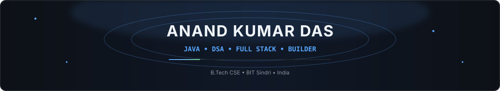
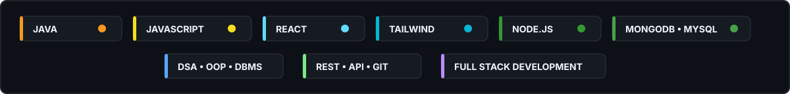
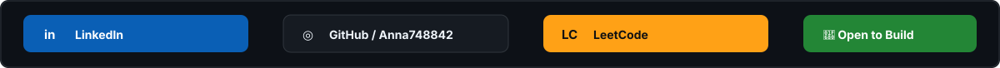

<!--
=============================================================
 ANAND KUMAR DAS — GitHub Profile README
 Compact animated dashboard inspired by the supplied reference
=============================================================
-->

<!-- ===================== ANIMATED HEADER ===================== -->

  

  
  
  

<!-- ===================== QUICK INTRO ======================= -->

  

 

<!-- ===================== STATS DASHBOARD =================== -->

<table align="center">
<tr>
<td width="56%" align="center">

</td>
<td width="44%" align="center">

</td>
</tr>
</table>

<!-- ===================== STREAK ROW ======================== -->

<table align="center">
<tr>
<td width="70%" align="center">

</td>
<td width="30%" align="center">

</td>
</tr>
</table>

<!-- ======================== TECH STACK ===================== -->

## 💻 Tech Stack

  

  

<!-- ======================= SOCIALS ========================== -->

## 🌐 Socials

  

  
  
  

<!-- ===================== WHAT I'M BUILDING ================== -->

## 🚀 What I'm Building

<table align="center">
<tr>

<td width="50%" valign="top">

### 🧠 Smriti Setu
**AI-Based Cognitive & Memory Assistance Platform**

`Cognitive Games` `Memory` `Voice AI` `Reminders` `Tracking` `Caregiver Dashboard`

**SIH 2026 • Team Error400**

</td>

<td width="50%" valign="top">

### 🌱 HUNAR SETU
**Skill-to-Market Platform for Rural & Tribal Women**

`Skill Development` `Certification` `Digital Profiles` `SHGs` `Bulk Orders` `Buyer Network`

**IDEA Tribe 2026 • Team RootRuse**

</td>

</tr>
<tr>

<td width="50%" valign="top">

### 🏥 MedEase
**Doctor & Patient Healthcare Platform**

`JavaScript` `Tailwind CSS` `PHP` `MySQL` `REST API` `Role-Based Access`

</td>

<td width="50%" valign="top">

### 💻 Anand Portfolio
**Modern Developer Portfolio**

`React` `JavaScript` `Tailwind CSS` `Node.js` `Express.js`

</td>

</tr>
</table>

<!-- ===================== CONTRIBUTION GRAPH ================= -->

## 📈 Contribution Activity

  

<!-- ===================== CONTRIBUTION SNAKE ================= -->

## 🐍 Contribution Snake

  <picture>
    <source
      media="(prefers-color-scheme: dark)"
      srcset="https://raw.githubusercontent.com/Anna748842/Anna748842/output/github-contribution-grid-snake-dark.svg"
    />
    <source
      media="(prefers-color-scheme: light)"
      srcset="https://raw.githubusercontent.com/Anna748842/Anna748842/output/github-contribution-grid-snake.svg"
    />
    
  </picture>

<!-- ===================== TROPHIES ========================== -->

## 🏆 GitHub Trophies

  

<!-- ======================== DSA ============================= -->

## 🧩 DSA / Problem Solving

  
  
  

  Arrays • Strings • Searching • Sorting • Linked Lists • Stack • Queue

<!-- ======================== EDUCATION ====================== -->

## 🎓 Education

  
  

<!-- ======================== QUOTE =========================== -->

  

<!-- ===================== PROJECT STRIP ===================== -->

  

<!-- ========================= FOOTER ======================== -->

  

  <b>⚡ Learn • Build • Debug • Ship • Repeat ⚡</b>

