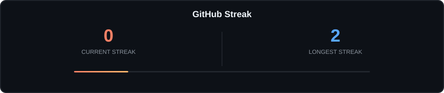
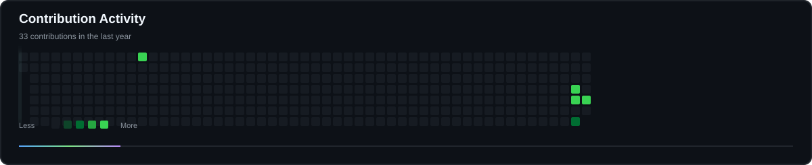

<!-- ========================================================= -->
<!--                  ANAND KUMAR DAS                          -->
<!--              GitHub Profile README                       -->
<!-- ========================================================= -->

<!-- ===================== ANIMATED HERO ====================== -->

<p align="center">
  
</p>

<!-- ===================== PROFILE INFO ======================= -->

<p align="center">

<a href="https://github.com/Anna748842">
  
</a>

<a href="https://github.com/Anna748842">
  
</a>


</p>

<!-- ===================== TYPING ============================= -->

<p align="center">


</p>

<br>

<!-- ========================================================= -->
<!--                     GITHUB STATS                          -->
<!-- ========================================================= -->

<table align="center" width="100%">

<tr>

<td width="58%" align="center">

<h3>📊 GitHub Stats</h3>



</td>

<td width="42%" align="center">

<h3>🧠 Most Used Languages</h3>



</td>

</tr>

</table>

<br>

<!-- ========================================================= -->
<!--                       STREAK                              -->
<!-- ========================================================= -->

<p align="center">



</p>

<!-- ========================================================= -->
<!--                       TECH STACK                         -->
<!-- ========================================================= -->

## 💻 Tech Stack

<p align="center">


</p>

<p align="center">


</p>

<br>

<!-- ========================================================= -->
<!--                        CORE SKILLS                        -->
<!-- ========================================================= -->

<p align="center">


</p>

<!-- ========================================================= -->
<!--                         SOCIALS                           -->
<!-- ========================================================= -->

## 🌐 Socials

<p align="center">


</p>

<p align="center">

<a href="https://www.linkedin.com/in/anand-kumar-das-9791723b4">
  
</a>

<a href="https://github.com/Anna748842">
  
</a>

<a href="https://leetcode.com/u/anand_kumar_das_1o9/">
  
</a>

</p>

<!-- ========================================================= -->
<!--                     WHAT I'M BUILDING                     -->
<!-- ========================================================= -->

## 🚀 What I'm Building

<table width="100%">

<tr>

<td width="50%" valign="top">

### 🧠 Smriti Setu

**AI-Based Cognitive & Memory Assistance Platform**

`Cognitive Games`

`Memory Assistance`

`Voice AI`

`Reminders`

`Performance Tracking`

`Caregiver Dashboard`

**SIH 2026 • Team Error400**

</td>

<td width="50%" valign="top">

### 🌱 HUNAR SETU

**Skill-to-Market Platform for Rural & Tribal Women**

`Skill Development`

`Certification`

`Digital Profiles`

`SHGs`

`Bulk Orders`

`Buyer Connections`

**IDEA Tribe 2026 • Team RootRuse**

</td>

</tr>

<tr>

<td width="50%" valign="top">

### 🏥 MedEase

**Doctor & Patient Healthcare Platform**

`JavaScript`

`Tailwind CSS`

`PHP`

`MySQL`

`REST API`

`Role-Based Access`

</td>

<td width="50%" valign="top">

### 💻 Anand Portfolio

**Modern Developer Portfolio**

`React`

`JavaScript`

`Tailwind CSS`

`Node.js`

`Express.js`

<br>

<a href="https://anna748842.github.io/Anand-Portfolio/">
  
</a>

</td>

</tr>

</table>

<!-- ========================================================= -->
<!--                  CONTRIBUTION ACTIVITY                    -->
<!-- ========================================================= -->

## 📈 Contribution Activity

<p align="center">



</p>

<!-- ========================================================= -->
<!--                   CONTRIBUTION SNAKE                      -->
<!-- ========================================================= -->

## 🐍 Contribution Snake

<p align="center">

<picture>

<source
  media="(prefers-color-scheme: dark)"
  srcset="https://raw.githubusercontent.com/Anna748842/Anna748842/output/github-contribution-grid-snake-dark.svg"
/>

<source
  media="(prefers-color-scheme: light)"
  srcset="https://raw.githubusercontent.com/Anna748842/Anna748842/output/github-contribution-grid-snake.svg"
/>


</picture>

</p>

<!-- ========================================================= -->
<!--                     GITHUB TROPHIES                       -->
<!-- ========================================================= -->

## 🏆 GitHub Trophies

<p align="center">



</p>

<!-- ========================================================= -->
<!--                      DSA SECTION                          -->
<!-- ========================================================= -->

## 🧩 DSA / Problem Solving

<p align="center">


</p>

<p align="center">

Arrays • Strings • Two Pointers • Searching • Sorting • Linked Lists • Stack • Queue

</p>

<!-- ========================================================= -->
<!--                       EDUCATION                           -->
<!-- ========================================================= -->

## 🎓 Education

<p align="center">


</p>

<!-- ========================================================= -->
<!--                  HACKATHONS & INNOVATION                 -->
<!-- ========================================================= -->

## 🏆 Innovation & Hackathons

<p align="center">


</p>

<p align="center">

<b>Team Leader</b> • Product Development • Problem Solving • UI/UX • Full Stack

</p>

<!-- ========================================================= -->
<!--                      ANIMATED STRIP                       -->
<!-- ========================================================= -->

<p align="center">


</p>

<!-- ========================================================= -->
<!--                      CURRENT FOCUS                        -->
<!-- ========================================================= -->

## 🎯 Current Focus

<p align="center">


</p>

<!-- ========================================================= -->
<!--                    DEVELOPER PHILOSOPHY                   -->
<!-- ========================================================= -->

## ⚡ Developer Philosophy

<p align="center">

```text
Learn
  ↓
Build
  ↓
Debug
  ↓
Improve
  ↓
Ship
  ↓
Repeat